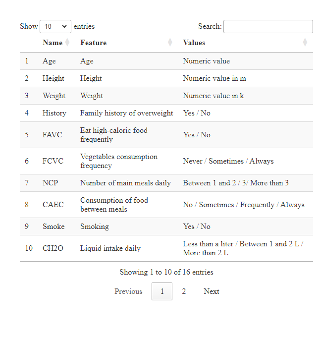
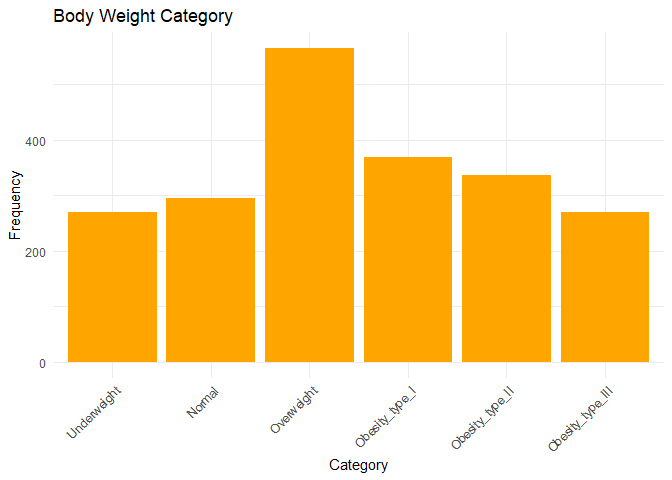
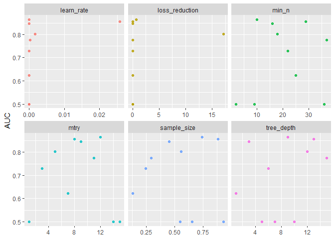
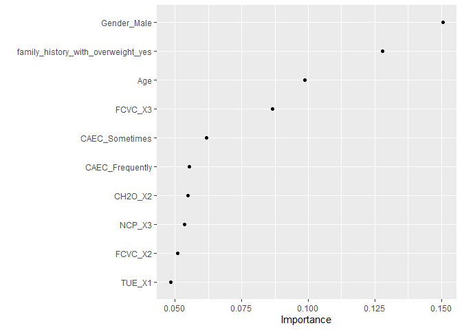
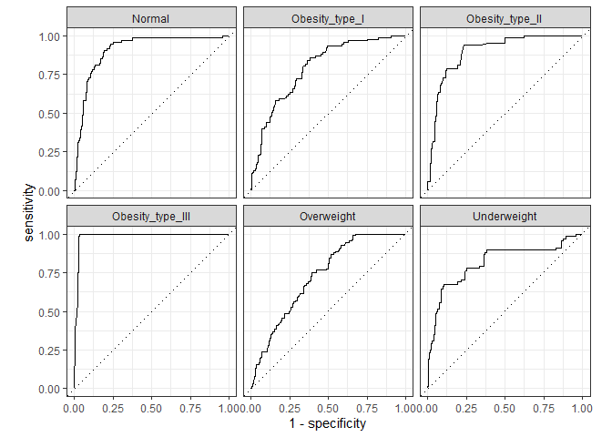

Overweight prediction with XGBoost
================

In this project, I aim to predict the development of overweight and
obesity. To achieve this, I will employ the XGBoost algorithm and
fine-tune its hyperparameters to optimize the model’s performance. The
analysis will be conducted within the `tidymodels` framework. Data set
available at
<https://archive.ics.uci.edu/dataset/544/estimation+of+obesity+levels+based+on+eating+habits+and+physical+condition>.

### Exploring data

``` r
#Obesity <- read.csv('C:/Users/veron/Documents/Project_xgboost/ObesityDataSet.csv')
Obesity <- read.csv('ObesityDataSet.csv')
options(warn = -1)
head(Obesity)
```

    ##   Gender Age Height Weight family_history_with_overweight FAVC FCVC NCP
    ## 1 Female  21   1.62   64.0                            yes   no    2   3
    ## 2 Female  21   1.52   56.0                            yes   no    3   3
    ## 3   Male  23   1.80   77.0                            yes   no    2   3
    ## 4   Male  27   1.80   87.0                             no   no    3   3
    ## 5   Male  22   1.78   89.8                             no   no    2   1
    ## 6   Male  29   1.62   53.0                             no  yes    2   3
    ##        CAEC SMOKE CH2O SCC FAF TUE       CALC                MTRANS
    ## 1 Sometimes    no    2  no   0   1         no Public_Transportation
    ## 2 Sometimes   yes    3 yes   3   0  Sometimes Public_Transportation
    ## 3 Sometimes    no    2  no   2   1 Frequently Public_Transportation
    ## 4 Sometimes    no    2  no   2   0 Frequently               Walking
    ## 5 Sometimes    no    2  no   0   0  Sometimes Public_Transportation
    ## 6 Sometimes    no    2  no   0   0  Sometimes            Automobile
    ##            NObeyesdad
    ## 1       Normal_Weight
    ## 2       Normal_Weight
    ## 3       Normal_Weight
    ## 4  Overweight_Level_I
    ## 5 Overweight_Level_II
    ## 6       Normal_Weight

##### Overview of the dataset’s characteristics

``` r
# Features and values/categories
table <- read.csv("table (2).csv")
datatable(table)
```

<!-- -->

``` r
skim_without_charts(Obesity)
```

|                                                  |         |
|:-------------------------------------------------|:--------|
| Name                                             | Obesity |
| Number of rows                                   | 2111    |
| Number of columns                                | 17      |
| \_\_\_\_\_\_\_\_\_\_\_\_\_\_\_\_\_\_\_\_\_\_\_   |         |
| Column type frequency:                           |         |
| character                                        | 9       |
| numeric                                          | 8       |
| \_\_\_\_\_\_\_\_\_\_\_\_\_\_\_\_\_\_\_\_\_\_\_\_ |         |
| Group variables                                  | None    |

Data summary

**Variable type: character**

| skim_variable | n_missing | complete_rate | min | max | empty | n_unique | whitespace |
|:---|---:|---:|---:|---:|---:|---:|---:|
| Gender | 0 | 1 | 4 | 6 | 0 | 2 | 0 |
| family_history_with_overweight | 0 | 1 | 2 | 3 | 0 | 2 | 0 |
| FAVC | 0 | 1 | 2 | 3 | 0 | 2 | 0 |
| CAEC | 0 | 1 | 2 | 10 | 0 | 4 | 0 |
| SMOKE | 0 | 1 | 2 | 3 | 0 | 2 | 0 |
| SCC | 0 | 1 | 2 | 3 | 0 | 2 | 0 |
| CALC | 0 | 1 | 2 | 10 | 0 | 4 | 0 |
| MTRANS | 0 | 1 | 4 | 21 | 0 | 5 | 0 |
| NObeyesdad | 0 | 1 | 13 | 19 | 0 | 7 | 0 |

**Variable type: numeric**

| skim_variable | n_missing | complete_rate |  mean |    sd |    p0 |   p25 |   p50 |    p75 |   p100 |
|:--------------|----------:|--------------:|------:|------:|------:|------:|------:|-------:|-------:|
| Age           |         0 |             1 | 24.31 |  6.35 | 14.00 | 19.95 | 22.78 |  26.00 |  61.00 |
| Height        |         0 |             1 |  1.70 |  0.09 |  1.45 |  1.63 |  1.70 |   1.77 |   1.98 |
| Weight        |         0 |             1 | 86.59 | 26.19 | 39.00 | 65.47 | 83.00 | 107.43 | 173.00 |
| FCVC          |         0 |             1 |  2.42 |  0.53 |  1.00 |  2.00 |  2.39 |   3.00 |   3.00 |
| NCP           |         0 |             1 |  2.69 |  0.78 |  1.00 |  2.66 |  3.00 |   3.00 |   4.00 |
| CH2O          |         0 |             1 |  2.01 |  0.61 |  1.00 |  1.58 |  2.00 |   2.48 |   3.00 |
| FAF           |         0 |             1 |  1.01 |  0.85 |  0.00 |  0.12 |  1.00 |   1.67 |   3.00 |
| TUE           |         0 |             1 |  0.66 |  0.61 |  0.00 |  0.00 |  0.63 |   1.00 |   2.00 |

##### BMI recategorization

``` r
Obesity <- Obesity %>% 
  mutate(BMI = Weight / (Height * Height))
categories <- c("Underweight", "Normal", "Overweight", "Obesity_type_I", "Obesity_type_II", "Obesity_type_III")
limits_BMI <- c(0, 18.5, 24.9, 29.9, 34.9, 39.9, Inf)

BMI_class <- function(bmi) {
  category <- cut(bmi, breaks = limits_BMI, labels = categories)
  return(category)
}

Obesity <- Obesity %>%
  mutate(BMI_category = BMI_class(BMI))

# Variable 'NObeyesdad' is eliminated
Obesity <- Obesity %>%
  select(-NObeyesdad)

# Checking if the dataset has been modified
head(Obesity)
```

    ##   Gender Age Height Weight family_history_with_overweight FAVC FCVC NCP
    ## 1 Female  21   1.62   64.0                            yes   no    2   3
    ## 2 Female  21   1.52   56.0                            yes   no    3   3
    ## 3   Male  23   1.80   77.0                            yes   no    2   3
    ## 4   Male  27   1.80   87.0                             no   no    3   3
    ## 5   Male  22   1.78   89.8                             no   no    2   1
    ## 6   Male  29   1.62   53.0                             no  yes    2   3
    ##        CAEC SMOKE CH2O SCC FAF TUE       CALC                MTRANS      BMI
    ## 1 Sometimes    no    2  no   0   1         no Public_Transportation 24.38653
    ## 2 Sometimes   yes    3 yes   3   0  Sometimes Public_Transportation 24.23823
    ## 3 Sometimes    no    2  no   2   1 Frequently Public_Transportation 23.76543
    ## 4 Sometimes    no    2  no   2   0 Frequently               Walking 26.85185
    ## 5 Sometimes    no    2  no   0   0  Sometimes Public_Transportation 28.34238
    ## 6 Sometimes    no    2  no   0   0  Sometimes            Automobile 20.19509
    ##   BMI_category
    ## 1       Normal
    ## 2       Normal
    ## 3       Normal
    ## 4   Overweight
    ## 5   Overweight
    ## 6       Normal

##### Checking if classes are balanced

``` r
frec_ns <- Obesity %>%
  count(BMI_category)

ggplot(frec_ns, aes(x = BMI_category, y = n)) +
  geom_bar(stat = "identity", fill = "orange") +
  labs(title = "Body Weight Category",
       x = "Category",
       y = "Frequency") +
  theme_minimal() +
  theme(axis.text.x = element_text(angle = 45, hjust = 1))
```

<!-- -->

``` r
# I decided to remove the weight variable because the labels are calculated from it, I also removed BMI because it is used categorized.
Obesity <- Obesity %>%
  select(-Weight, -BMI)
```

##### Due to their encoding with numeric values rather than words, certain categorical variables are currently being interpreted as numeric. It is necessary to convert them into factors to ensure their correct interpretation by the model.

``` r
Obesity <- Obesity %>%
  mutate(
    FCVC = as.factor(FCVC),
    NCP = as.factor(NCP),
    TUE = as.factor(TUE),
    CH2O = as.factor(CH2O),
    FAF = as.factor(FAF)
  )
```

### Split into train y test

``` r
set.seed(123)
o_split <- Obesity %>% 
  initial_split(prop = 0.75, strata = BMI_category)
o_train <- training(o_split)
o_test <- testing(o_split)
```

### Definition and preparation of a data preprocessing recipe

``` r
recipe_dt <- recipe(BMI_category~., data = o_train) %>%
  step_corr(all_numeric_predictors()) %>% #elimino las correlaciones
  step_center(all_numeric_predictors(), -all_outcomes()) %>% #centrado
  step_scale(all_numeric_predictors(), -all_outcomes()) %>% #escalado
  step_dummy(all_nominal_predictors())

prepared_recipe <- recipe_dt %>% prep()
prepared_recipe
```

    ## 

    ## ── Recipe ──────────────────────────────────────────────────────────────────────

    ## 

    ## ── Inputs

    ## Number of variables by role

    ## outcome:    1
    ## predictor: 15

    ## 

    ## ── Training information

    ## Training data contained 1581 data points and no incomplete rows.

    ## 

    ## ── Operations

    ## • Correlation filter on: <none> | Trained

    ## • Centering for: Age and Height | Trained

    ## • Scaling for: Age and Height | Trained

    ## • Dummy variables from: Gender, ... | Trained

### Tuning

``` r
# Model specifications

xgb_spec <- boost_tree(
  trees = 1000,
  tree_depth = tune(), min_n = tune(),
  loss_reduction = tune(),                     ## first three: model complexity
  sample_size = tune(), mtry = tune(),         ## randomness
  learn_rate = tune()                          ## step size
) %>%
  set_engine("xgboost") %>%
  set_mode("classification")

xgb_spec
```

    ## Boosted Tree Model Specification (classification)
    ## 
    ## Main Arguments:
    ##   mtry = tune()
    ##   trees = 1000
    ##   min_n = tune()
    ##   tree_depth = tune()
    ##   learn_rate = tune()
    ##   loss_reduction = tune()
    ##   sample_size = tune()
    ## 
    ## Computational engine: xgboost

##### Creating a grid of Potential Hyperparameter Values. Space-filling design to thoroughly explore the hyperparameter space.

``` r
xgb_grid <- grid_latin_hypercube(
  tree_depth(),
  min_n(),
  loss_reduction(),
  sample_size = sample_prop(),
  finalize(mtry(), o_train),
  learn_rate(),
  size = 10
)

xgb_grid
```

    ## # A tibble: 10 × 6
    ##    tree_depth min_n loss_reduction sample_size  mtry learn_rate
    ##         <int> <int>          <dbl>       <dbl> <int>      <dbl>
    ##  1          5     2       4.75e- 8       0.930     1   2.23e-10
    ##  2         12    18       1.71e+ 1       0.555     5   1.74e- 3
    ##  3          1    25       1.47e- 2       0.128     7   4.18e- 7
    ##  4          3    16       9.83e- 4       0.451     9   1.32e- 7
    ##  5         15    37       2.28e-10       0.295    11   2.80e- 4
    ##  6          9    10       7.33e- 1       0.744    12   2.70e- 5
    ##  7         10     9       5.10e- 9       0.653    14   1.07e- 9
    ##  8         13    29       1.69e- 4       0.884     8   2.58e- 2
    ##  9          7    36       5.62e- 6       0.546    15   8.08e- 9
    ## 10          6    22       1.20e- 6       0.246     3   2.01e- 5

``` r
# Workflow creation

xgb_wf <- workflow() %>%
  add_formula(BMI_category~.) %>% 
  add_model(xgb_spec)

xgb_wf
```

    ## ══ Workflow ════════════════════════════════════════════════════════════════════
    ## Preprocessor: Formula
    ## Model: boost_tree()
    ## 
    ## ── Preprocessor ────────────────────────────────────────────────────────────────
    ## BMI_category ~ .
    ## 
    ## ── Model ───────────────────────────────────────────────────────────────────────
    ## Boosted Tree Model Specification (classification)
    ## 
    ## Main Arguments:
    ##   mtry = tune()
    ##   trees = 1000
    ##   min_n = tune()
    ##   tree_depth = tune()
    ##   learn_rate = tune()
    ##   loss_reduction = tune()
    ##   sample_size = tune()
    ## 
    ## Computational engine: xgboost

``` r
# Validation
o_folds <- vfold_cv(juice(prepared_recipe), strata = BMI_category)
```

##### Finding the optimal hyperparameter configuration that maximizes model performance.

``` r
doParallel::registerDoParallel()

set.seed(234)
xgb_res <- tune_grid(
  xgb_wf,
  resamples = o_folds,
  grid = xgb_grid,
  control = control_grid(save_pred = TRUE)
)

xgb_res
```

    ## # Tuning results
    ## # 10-fold cross-validation using stratification 
    ## # A tibble: 10 × 5
    ##    splits             id     .metrics           .notes           .predictions
    ##    <list>             <chr>  <list>             <list>           <list>      
    ##  1 <split [1419/162]> Fold01 <tibble [30 × 10]> <tibble [0 × 3]> <tibble>    
    ##  2 <split [1419/162]> Fold02 <tibble [30 × 10]> <tibble [0 × 3]> <tibble>    
    ##  3 <split [1421/160]> Fold03 <tibble [30 × 10]> <tibble [0 × 3]> <tibble>    
    ##  4 <split [1423/158]> Fold04 <tibble [30 × 10]> <tibble [0 × 3]> <tibble>    
    ##  5 <split [1424/157]> Fold05 <tibble [30 × 10]> <tibble [0 × 3]> <tibble>    
    ##  6 <split [1424/157]> Fold06 <tibble [30 × 10]> <tibble [0 × 3]> <tibble>    
    ##  7 <split [1424/157]> Fold07 <tibble [30 × 10]> <tibble [0 × 3]> <tibble>    
    ##  8 <split [1425/156]> Fold08 <tibble [30 × 10]> <tibble [0 × 3]> <tibble>    
    ##  9 <split [1425/156]> Fold09 <tibble [30 × 10]> <tibble [0 × 3]> <tibble>    
    ## 10 <split [1425/156]> Fold10 <tibble [30 × 10]> <tibble [0 × 3]> <tibble>

``` r
# Collect and summarize performance metrics for all hyperparameter combinations tested during the tuning process

collect_metrics(xgb_res)
```

    ## # A tibble: 30 × 12
    ##     mtry min_n tree_depth learn_rate loss_reduction sample_size .metric    
    ##    <int> <int>      <int>      <dbl>          <dbl>       <dbl> <chr>      
    ##  1     1     2          5   2.23e-10   0.0000000475       0.930 accuracy   
    ##  2     1     2          5   2.23e-10   0.0000000475       0.930 brier_class
    ##  3     1     2          5   2.23e-10   0.0000000475       0.930 roc_auc    
    ##  4     5    18         12   1.74e- 3  17.1                0.555 accuracy   
    ##  5     5    18         12   1.74e- 3  17.1                0.555 brier_class
    ##  6     5    18         12   1.74e- 3  17.1                0.555 roc_auc    
    ##  7     7    25          1   4.18e- 7   0.0147             0.128 accuracy   
    ##  8     7    25          1   4.18e- 7   0.0147             0.128 brier_class
    ##  9     7    25          1   4.18e- 7   0.0147             0.128 roc_auc    
    ## 10     9    16          3   1.32e- 7   0.000983           0.451 accuracy   
    ## # ℹ 20 more rows
    ## # ℹ 5 more variables: .estimator <chr>, mean <dbl>, n <int>, std_err <dbl>,
    ## #   .config <chr>

##### Visualization of the impact of the different hyperparameters on the performance of the model (average variation of the AUC)

``` r
xgb_res %>%
  collect_metrics() %>%
  filter(.metric == "roc_auc") %>%
  select(mean, mtry:sample_size) %>%
  pivot_longer(mtry:sample_size,
               values_to = "value",
               names_to = "parameter"
  ) %>%
  ggplot(aes(value, mean, color = parameter)) +
  geom_point(alpha = 0.8, show.legend = FALSE) +
  facet_wrap(~parameter, scales = "free_x") +
  labs(x = NULL, y = "AUC")
```

<!-- -->

##### Selecting and showing the best combination of hyperparameters from the tuning results using the ROC AUC as the performance metric.

``` r
best_auc <- select_best(xgb_res, metric = "roc_auc")
show_best(xgb_res, metric = "roc_auc")
```

    ## # A tibble: 5 × 12
    ##    mtry min_n tree_depth  learn_rate loss_reduction sample_size .metric
    ##   <int> <int>      <int>       <dbl>          <dbl>       <dbl> <chr>  
    ## 1    12    10          9 0.0000270         7.33e- 1       0.744 roc_auc
    ## 2     8    29         13 0.0258            1.69e- 4       0.884 roc_auc
    ## 3     9    16          3 0.000000132       9.83e- 4       0.451 roc_auc
    ## 4     5    18         12 0.00174           1.71e+ 1       0.555 roc_auc
    ## 5    11    37         15 0.000280          2.28e-10       0.295 roc_auc
    ## # ℹ 5 more variables: .estimator <chr>, mean <dbl>, n <int>, std_err <dbl>,
    ## #   .config <chr>

``` r
#The finalize_workflow() function is used to update a workflow with the best hyperparameter values

final_xgb <- finalize_workflow(
  xgb_wf,
  best_auc
)

final_xgb
```

    ## ══ Workflow ════════════════════════════════════════════════════════════════════
    ## Preprocessor: Formula
    ## Model: boost_tree()
    ## 
    ## ── Preprocessor ────────────────────────────────────────────────────────────────
    ## BMI_category ~ .
    ## 
    ## ── Model ───────────────────────────────────────────────────────────────────────
    ## Boosted Tree Model Specification (classification)
    ## 
    ## Main Arguments:
    ##   mtry = 12
    ##   trees = 1000
    ##   min_n = 10
    ##   tree_depth = 9
    ##   learn_rate = 2.70443666936591e-05
    ##   loss_reduction = 0.732984993352817
    ##   sample_size = 0.743948484533466
    ## 
    ## Computational engine: xgboost

### Fitting the XGBoost model

``` r
final_xgb %>%
  fit(juice(prepared_recipe)) %>%  #data extracted from the prepared_recipe object
  pull_workflow_fit() %>%
  vip(geom = "point")
```

<!-- -->

``` r
# last_fit() emulates the process where, after determining the best model, the final fit on the entire training set is needed and is then evaluated on the test set

final_res <- last_fit(final_xgb, o_split)
```

    ## → A | warning: Novel levels found in column 'CALC': 'Always'. The levels have been removed, and values have been coerced to 'NA'.

    ## There were issues with some computations   A: x1There were issues with some computations   A: x1

``` r
collect_metrics(final_res)
```

    ## # A tibble: 3 × 4
    ##   .metric     .estimator .estimate .config             
    ##   <chr>       <chr>          <dbl> <chr>               
    ## 1 accuracy    multiclass     0.268 Preprocessor1_Model1
    ## 2 roc_auc     hand_till      0.866 Preprocessor1_Model1
    ## 3 brier_class multiclass     0.416 Preprocessor1_Model1

``` r
# Prediction collection
predictions <- final_res %>%
  collect_predictions()

# Confusion matrix
predictions %>%
  conf_mat(BMI_category, .pred_class)
```

    ##                   Truth
    ## Prediction         Underweight Normal Overweight Obesity_type_I Obesity_type_II
    ##   Underweight                0      0          0              0               0
    ##   Normal                     0      0          0              0               0
    ##   Overweight                68     74        142             93              85
    ##   Obesity_type_I             0      0          0              0               0
    ##   Obesity_type_II            0      0          0              0               0
    ##   Obesity_type_III           0      0          0              0               0
    ##                   Truth
    ## Prediction         Obesity_type_III
    ##   Underweight                     0
    ##   Normal                          0
    ##   Overweight                     68
    ##   Obesity_type_I                  0
    ##   Obesity_type_II                 0
    ##   Obesity_type_III                0

``` r
# Calculation of ROC curves for each class
roc_curve_data <- predictions %>%
  roc_curve(truth = BMI_category,
            .pred_Underweight,
            .pred_Normal,
            .pred_Overweight,
            .pred_Obesity_type_I,
            .pred_Obesity_type_II,
            .pred_Obesity_type_III)

autoplot(roc_curve_data)
```

<!-- -->

### Conclusion

The dataset contains 17 attributes and 2111 records from individuals
from Mexico, Peru, and Colombia. 23% of the data was collected directly
from users through a web platform and 77% was generated synthetically
using the Weka tool and the SMOTE filter
(<https://www.ncbi.nlm.nih.gov/pmc/articles/PMC6710633/>). For this
analysis, it was decided to recategorize the BMI variable, since it was
not interesting to have two overweight categories. Another possible
categorization would have been to group the 3 obesity categories into
one, which will remain pending for a future analysis. It was also
decided not to use the weight variable, as it strongly correlates with
BMI.

The model presents an acceptable general performance (AUC 0.86),
although it can be observed that the greater the degree of excess
weight, the better the model’s ability to classify the corresponding
category.

After analyzing data, it was observed that the main predictors of excess
weight are male sex, family history of overweight, and age, all
non-modifiable risk factors.

``` r
#rmarkdown::render("projxgb.Rmd", output_file = "Obesity_final.html")

#rmarkdown::render("projxgb.Rmd", output_file = "Obesity_final.pdf")
```
